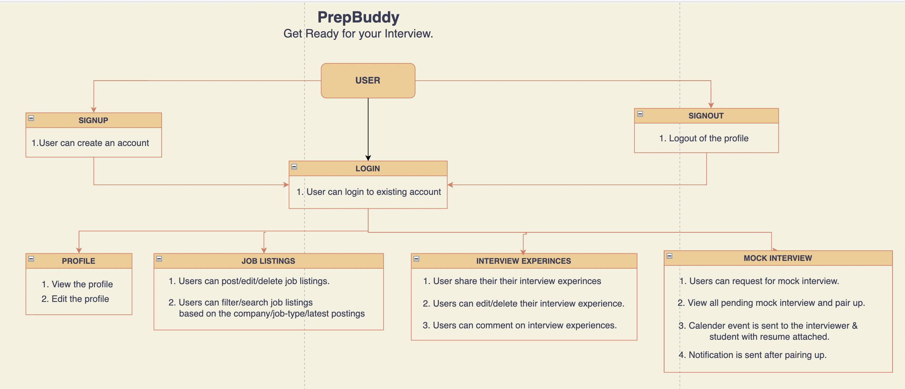

# Project: PrepBuddy 
PrepBuddy is an web application that helps you in interview preparation from getting to know about the latest job openings to learn from others interview experiences in the the community to getting one to one mock interviews giving you confidence before showing up the actual one.

# Demo Video
[PrepBuddy Demo Video](https://northeastern-my.sharepoint.com/:v:/g/personal/ruthala_s_northeastern_edu/EaXBbCri8XdOq4UW7KhLpuABPP2S0t0hRd0IAHjuNlt0kg?e=Ly2nyF)

## Team Members
1. Tiyasha Sen - sen.ti@northeastern.edu  
2. Nikhil Reddy Polepally - polepally.n@northeastern.edu  
3. Sanjay Varma Datla - datla.sa@northeastern.edu  
4. Shiva Sai Charan Ruthala - ruthala.s@northeastern.edu  

## User Requirements
1. SignUp: A user can create an account with their firstName, lastName, email and password.  
           An verfication email will be sent to the user email address for validation.  
3. Sign in: New users can only be able to login once their email verification is done.  
            Existing Users can login into their account with their credentials. 
4. Existing users can share links & details of companies job postings they came across and can also edit/delete accordingly.  
5. Existing users can filter and search job postings based on company and job type or earliest date.  
6. Users can share their interview experiences with the community & they can also edit/delete once posted.   
7. Users can able to comment on any interview experience.  
8. User in the community can request for mock interviews and exchange feedbacks.  
9. Users can track their calender for different events.  

## Domain Model Diagram

